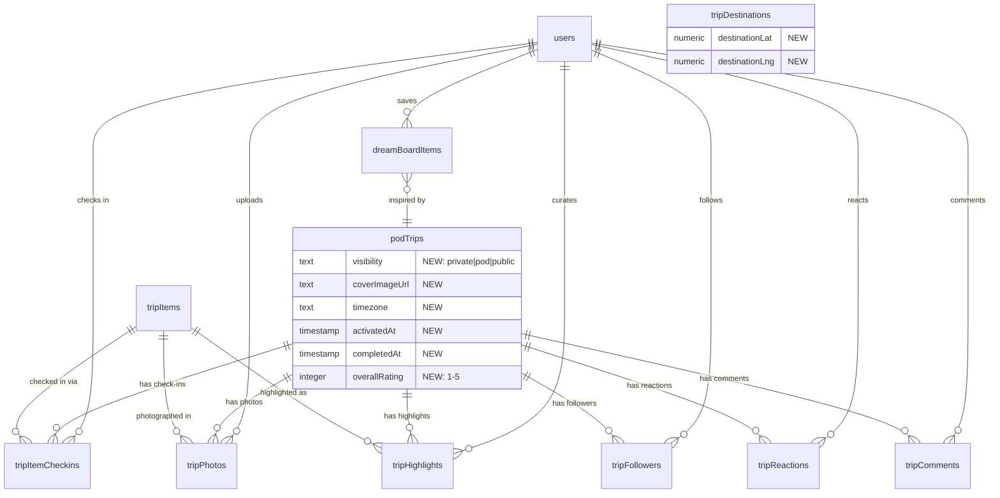

# feat: Full Trip Lifecycle -- Dream, Plan, Travel, Remember

## Overview

Transform FamVoy's trip experience from a pre-trip planning tool into a **full trip lifecycle platform** that captures every phase of family travel: dreaming about where to go, planning the details, living the adventure, and preserving the memories forever.

Today, FamVoy excels at the **planning phase** -- AI itinerary generation, multi-destination support, the confirmation wizard, and concierge booking are genuinely great. But the app has nothing before that (no inspiration or discovery), nothing during the trip (no tracking, check-ins, or live sharing), and nothing after (no photos, memories, or travel profile). A family finishes their trip and the app goes silent until next year.

The vision: **a trip in FamVoy should feel like a living scrapbook that a family builds together before, during, and after their adventure -- and that they revisit for years to come.**

### The Opportunity

No travel app covers the full lifecycle well for families:
- **Polarsteps** does tracking + memories but has zero planning
- **Wanderlog** does collaborative planning but has no memory features
- **TripIt** does logistics but is purely utilitarian
- **Boop** does social discovery but has no family features

**An app that handles Discovery -> Planning -> On-Trip -> Memory -> Social for families would be uniquely positioned.** FamVoy already has the hardest part (planning + AI + booking). The remaining phases are more achievable and create the emotional stickiness that drives retention.

### The Retention Problem This Solves

Travel apps face brutal retention: **18% day-one, 2.8% after 30 days.** The only way to beat this is to give users reasons to open the app between trips. Memories, anniversary notifications, dream boards, and social feeds create ongoing engagement loops that keep families coming back.

---

## Problem Statement

### What's Missing Today

| Phase | Current State | User Impact |
|-------|--------------|-------------|
| **Discovery** | Nothing. User must already know where & when. | No inspiration, no "what should we do for spring break?" moment |
| **Planning** | Strong. AI generation, confirmation, booking. | This is the core strength -- protect and enhance it |
| **On-Trip** | Nothing. Trip goes stale the moment travel starts. | Family can't track progress, share with grandparents, or capture moments in context |
| **Post-Trip** | Past trips are just dimmed cards on a list. | No photos, no memories, no "remember when" moments. App becomes irrelevant after the trip. |
| **Social** | Trips don't appear in the home feed at all. | No discovery through friends' trips, no "the Smiths are in Barcelona" moments |

### What the Data Model Tells Us

The current schema (`shared/schema.ts`) has 10 trip-related tables focused entirely on planning and booking:
- `podTrips` -- status lifecycle: `draft -> confirming -> confirmed -> booking_in_progress -> booked`
- `tripDestinations`, `tripItems`, `tripItemOptions` -- itinerary structure
- `tripConfirmationSessions`, `tripItemBookingMeta` -- confirmation/booking flow
- `concierge*` tables -- agent-mediated booking

**Missing entirely:** photos, check-ins, memories, highlights, dream boards, trip followers, travel stats, trip comments/reactions. The `podTrips.status` field has no concept of `active` or `completed`.

### Key Insight from Research

The apps with the highest retention (Polarsteps, Google Photos) succeed by **creating emotional value through memories.** Users come back not because they need to plan -- they come back because they want to relive. The Year-in-Travel feature (like Spotify Wrapped for travel) is the single most shareable feature in travel apps and drives organic growth.

---

## Proposed Solution: Four Phases

### The Full Lifecycle

```
PHASE 1: DREAM                    PHASE 2: PLAN (existing)
Dream Board -> AI Suggestions      Create -> Generate -> Confirm -> Book
Browse Friends' Trips                       |
Copy a Trip ---------------------->         |
                                            v
PHASE 3: TRAVEL                    PHASE 4: REMEMBER
Today Card -> Check-ins            Trip Book -> Photos -> Stats
Photo Capture -> Live Sharing      Travel Profile -> Year-in-Travel
Offline Access                     Anniversary Memories -> Feed
```

---

## Phase 1: Dream -- Destination Discovery & Inspiration

### The Problem
Users open FamVoy only when they already know where they're going. There's no reason to open the app on a random Tuesday evening when you're daydreaming about summer vacation on the couch.

### Features

#### 1A. Dream Board
A personal collection where families save destination ideas, activities, and trip inspiration -- like Pinterest for travel.

**User Flow:**
1. User navigates to new "Dreams" tab (alongside Trips in bottom nav, or as a sub-tab within Trips)
2. Sees their dream board with saved destination cards (image, name, notes, tags)
3. Taps "+" to add a new dream: enter destination name (Google Places autocomplete), add notes, pick interest tags
4. Can also save from other places in the app: completed trips, experiences, AI suggestions
5. When ready, taps "Plan This Trip" on a dream board item -> creates a new trip pre-filled with the destination

**Data Model:**
```
dreamBoardItems
  id: serial PK
  userId: integer FK -> users.id
  destinationName: text
  destinationPlaceId: text (nullable, Google Places ID)
  coverImageUrl: text (nullable)
  notes: text (nullable)
  tags: text[] (e.g., ["beach", "kid-friendly", "budget"])
  sourceTripId: integer (nullable, FK -> podTrips.id, if saved from another trip)
  createdAt: timestamp
```

#### 1B. AI Destination Suggestions
Contextual, personalized "where should we go?" recommendations based on the family's profile.

**User Flow:**
1. On the Dreams tab, a "Suggest Destinations" card appears
2. User optionally inputs: when (month/season), budget range, trip style (beach/city/adventure/nature)
3. AI generates 3-5 destination suggestions with: why it's great for your family, best time to visit, estimated budget, sample activities
4. User can save any suggestion to their dream board or immediately start planning

**How it works:** Uses the same OpenAI integration as itinerary generation. Prompt includes family members' ages (from `familyMembers` table), interests (from `users.interests`), past trip destinations (to avoid repeats), and the optional filters.

#### 1C. Browse Friends' Completed Trips
The best travel recommendations come from people you trust.

**User Flow:**
1. On the Dreams tab (or a "Discover" section), user sees completed trips from pod members and followed users
2. Cards show: destination photo, family name, dates, AI summary snippet, highlight reel (if available)
3. Tapping opens a read-only trip view
4. "Copy This Trip" button available on any viewable completed trip

#### 1D. Copy This Trip
Clone another family's itinerary as a starting point for your own trip.

**User Flow:**
1. User taps "Copy This Trip" on a completed trip they're viewing
2. System clones: trip name, destinations, and all items (without booking data)
3. New trip is created in `draft` status with blank dates, owned by the current user, no pod association
4. User is redirected to the new trip to set their dates and customize

**Server logic:** New `POST /api/trips/:id/copy` endpoint that:
- Clones `podTrips` record (new id, new `createdByUserId`, `status: "draft"`, null dates, null `podId`)
- Clones `tripDestinations` with relative day offsets preserved
- Clones `tripItems` (without `selectedOptionId`, `confirmationState` reset to `pending`)
- Does NOT clone `tripItemOptions`, `tripConfirmationSessions`, or concierge data

---

## Phase 2: Travel -- The On-Trip Experience

### The Problem
The moment a family starts their trip, FamVoy becomes irrelevant. There's no "I'm on Day 3 of my trip" experience. Grandparents can't follow along. Photos taken during the trip have no connection to the itinerary.

### Status Lifecycle Enhancement

Add two new trip statuses:

```
draft -> confirming -> confirmed -> booking_in_progress -> booked -> active -> completed
```

**Transition rules:**
- `active`: Triggered when today's date falls within the trip's date range. **Hybrid approach** -- computed on read by the client (for immediate display) AND persisted by a lightweight server-side check (for feed queries and notifications). The server check runs on any trip fetch/list request, updating status if dates match.
- `completed`: Triggered when today's date is after the trip's `endDate`. Same hybrid approach.
- Any trip can become `active` regardless of prior status (even `draft`) -- a family might plan loosely and just go.
- A trip cannot go backwards from `active` to a prior status (editing dates while active adjusts the active window but doesn't revert status).

**Schema changes to `podTrips`:**
```
+ activatedAt: timestamp (nullable)    -- when trip first became active
+ completedAt: timestamp (nullable)    -- when trip transitioned to completed
+ visibility: text (default "pod")     -- "private" | "pod" | "public"
+ coverImageUrl: text (nullable)       -- trip cover photo
+ timezone: text (nullable)            -- primary destination timezone, e.g. "Europe/Paris"
```

### Features

#### 2A. Today Card
A prominent, contextual view of "what's happening today" that becomes the primary trip interface during travel.

**User Flow:**
1. When a trip is `active`, the trip detail page shows a "Today" card at the top
2. Today card displays: day number ("Day 3"), date, weather icon + temp, and today's itinerary items in order
3. Each item shows: time, title, type icon, and a check-in button
4. Items for past days show completion status (checked in or missed)
5. Tomorrow's items are visible below in a dimmed section

**Day number computation:** `Math.ceil((Date.now() - new Date(trip.startDate).getTime()) / 86400000)`, adjusted for destination timezone.

**Weather:** Use a free weather API (OpenWeatherMap or WeatherAPI) with the destination's coordinates. Cache hourly. Show in the Today card header.

#### 2B. Check-ins
Mark itinerary items as done, building a live record of the trip as it happens.

**User Flow:**
1. User taps the check-in button on a Today card item
2. Optional: add a photo (camera or gallery) and caption
3. Item shows a green checkmark with timestamp
4. Check-in is visible to trip followers (if live sharing is enabled)

**Data Model:**
```
tripItemCheckins
  id: serial PK
  tripItemId: integer FK -> tripItems.id
  userId: integer FK -> users.id
  completedAt: timestamp (defaultNow)
  photoUrl: text (nullable)
  caption: text (nullable)
  locationLat: numeric (nullable)
  locationLng: numeric (nullable)
```

**Relationship to existing `experienceCheckins`:** These are separate concepts. Trip item check-ins record itinerary completion. Experience check-ins record community activity participation. If a trip item has an `experienceId`, completing the trip check-in could optionally also create an experience check-in.

#### 2C. Trip Photos
Photos captured during the trip, linked to specific days, items, and locations.

**User Flow:**
1. User taps camera icon on the Today card, a specific item, or a floating action button
2. Takes or selects a photo, adds optional caption
3. Photo is linked to the trip, and optionally to a specific item and day
4. Photos appear in a trip gallery organized by day
5. Photos taken with GPS data auto-tag to the location

**Data Model:**
```
tripPhotos
  id: serial PK
  tripId: integer FK -> podTrips.id
  tripItemId: integer (nullable, FK -> tripItems.id)
  dayNumber: integer (nullable)
  userId: integer FK -> users.id
  photoUrl: text
  caption: text (nullable)
  locationLat: numeric (nullable)
  locationLng: numeric (nullable)
  takenAt: timestamp (defaultNow)
  createdAt: timestamp (defaultNow)
```

**Photo storage:** For local development, store photos locally or use a cloud bucket. On Replit, use the existing GCS object storage. Abstract behind an upload service that works in both environments.

#### 2D. Live Trip Sharing
Let pod members and followers watch the trip unfold in real time.

**User Flow:**
1. Trip owner enables "Live Sharing" toggle in trip settings
2. Followers see a card in their feed: "The Wilkinsons are in Barcelona!"
3. Tapping opens a live trip view: map with route line, current city marker, completed check-ins
4. New check-ins and photos appear in real-time via existing WebSocket infrastructure
5. Followers can react with emoji (no comments on the live view to keep it simple)

**Privacy model (three tiers):**
| Visibility | Who Can See | What's Exposed |
|-----------|-------------|----------------|
| `private` | Trip creator only | Everything |
| `pod` | Pod members | Itinerary + check-ins + photos. Current city shown, not specific addresses. |
| `public` | Any authenticated FamVoy user who follows the creator | Current city + check-ins only. No hotel names, no future schedule. |

**Safety consideration:** Live sharing for families MUST be conservative by default. `pod` visibility is the default. Public sharing shows only city-level location and completed activities -- never hotel addresses, flight numbers, or future plans.

**Data Model:**
```
tripFollowers
  id: serial PK
  tripId: integer FK -> podTrips.id
  userId: integer FK -> users.id
  createdAt: timestamp (defaultNow)

  UNIQUE(tripId, userId)
```

#### 2E. Offline Mode (V2 -- can defer)
Itinerary access without connectivity.

**Approach:** Use the existing `vite-plugin-pwa` dependency to add a service worker that caches trip data for active trips. Read-only cache initially -- user can view itinerary, map, and item details offline. Check-ins and photo uploads queue locally and sync when connectivity returns.

**This is the most technically complex feature** in the entire spec. Recommend deferring to a later iteration and focusing on the higher-impact features (Today card, check-ins, photos, live sharing) first.

---

## Phase 3: Remember -- Post-Trip Memories

### The Problem
After a trip ends, the app goes silent. Past trips are just dimmed cards on a list. There's no reason to ever revisit them. The family's amazing photos live in a camera roll, disconnected from the trip context.

### Features

#### 3A. Trip Book
An auto-generated, beautiful day-by-day story of the trip, combining itinerary, photos, check-ins, and a route map.

**User Flow:**
1. Trip transitions to `completed` -> a "Your Trip Book is Ready!" notification appears
2. User opens the Trip Book: a scrollable, magazine-style view
3. Each day shows: day number, date, destination, photos (carousel), completed items with times, captions
4. A route map at the top shows the journey with destination pins connected by lines
5. Trip statistics banner: X days, Y places visited, Z photos
6. User can add/edit captions and add more photos after the fact

**Generation:** The Trip Book is assembled on-the-fly from existing data (trip items, check-ins, photos). No separate "generation" step needed -- it's a view that queries and arranges the data. If no check-ins or photos exist, the Trip Book shows a lighter version with just the itinerary and a prompt to add photos.

**UI Component:** A new `TripBook.tsx` page at `/trip/:id/book`, accessible from the trip detail page when status is `completed`. Uses Framer Motion for scroll-linked animations and day transitions.

#### 3B. Trip Statistics
Aggregate numbers that make the trip feel tangible and shareable.

**Stats to compute:**
- Days traveled (endDate - startDate)
- Destinations visited (count of `tripDestinations`)
- Activities completed (count of check-ins)
- Photos captured (count of `tripPhotos`)
- Distance traveled (sum of straight-line distances between consecutive destinations, using geocoded coordinates)

**Implementation:** Compute on read and cache. No separate stats table needed initially -- these are simple aggregations. Add a `travelStats` materialized cache later if performance requires it.

**Geocoding for distances:** When destinations are created/updated, geocode the destination name via Google Places and store lat/lng on `tripDestinations` (add `destinationLat` and `destinationLng` numeric columns).

#### 3C. Trip Highlights & Ratings
User-curated "best of" moments from the trip.

**User Flow:**
1. After trip completion (or anytime in the Trip Book), user can mark items as highlights
2. Star rating (1-5) for the overall trip
3. Pick "Top 3 Moments" from checked-in items
4. These highlights appear prominently in the Trip Book, on the profile, and in feed cards

**Data Model:**
```
tripHighlights
  id: serial PK
  tripId: integer FK -> podTrips.id
  tripItemId: integer (nullable, FK -> tripItems.id)
  userId: integer FK -> users.id
  highlightType: text ("favorite_moment" | "best_food" | "best_view" | "kids_favorite")
  notes: text (nullable)
  createdAt: timestamp (defaultNow)
```

Add to `podTrips`:
```
+ overallRating: integer (nullable, 1-5)
```

#### 3D. Family Travel Profile
A world map on the user's profile showing everywhere the family has traveled.

**User Flow:**
1. On the Profile page, a new "Travel Map" section shows a world map with pins for every completed trip destination
2. Below the map: aggregate stats (total trips, countries, cities, days traveling)
3. Tapping a pin shows the trip name and links to the Trip Book
4. Other users can see this on public/pod-visible profiles

**Implementation:** Use the existing `GoogleMapsProvider` and create a `TravelMap.tsx` component. Query all completed trips for the user, plot destination coordinates as markers. Cluster nearby pins using the existing `@googlemaps/markerclusterer`.

**Stats fields on Profile** (replace the current "No trip stats yet" placeholder at `Profile.tsx:630`):
- Total trips completed
- Countries visited (derive from destination geocoding)
- Total travel days
- Favorite trip (highest-rated)

#### 3E. Year-in-Travel Summary
"Spotify Wrapped" for family travel -- a shareable annual recap.

**User Flow:**
1. In December (or on demand), user gets a "Your Year in Travel" card on the home feed
2. Tapping opens a beautiful, swipeable story-format summary:
   - Total trips, days, destinations
   - Farthest destination from home
   - Most-visited destination
   - Favorite trip (by rating)
   - Photo highlights montage
   - Fun stats ("You spent 12 days at the beach this year!")
3. User can share the summary as an image to social media

**Generation:** AI-assisted -- use OpenAI to generate the narrative ("Your family covered 15,000 miles across 4 countries this year...") from the raw stats. Generate a shareable OG image using a canvas or server-side image generation.

**Timing:** Generated on-demand, available year-round but promoted in December/January.

#### 3F. Anniversary Memories
"1 year ago, your family was in Yellowstone."

**User Flow:**
1. On the home feed, a memory card appears on the anniversary of a trip's start date
2. Shows the trip cover photo, destination, and a "Relive This Trip" link
3. Tapping opens the Trip Book

**Implementation:** On each home feed load, query `podTrips` where `startDate` day/month matches today and status is `completed`. Simple date-part comparison -- no cron job needed.

**Frequency:** One card per trip, shown on the start date anniversary. Not 14 cards for a 14-day trip.

---

## Phase 4: Social -- Trips in the Feed

### The Problem
The home feed has zero trip content. Trips are invisible to anyone except the creator and pod members. There's no social discovery through travel.

### Features

#### 4A. Active Trips in Feed ("Traveling Now")
A new section on the home feed showing families currently on trips.

**User Flow:**
1. Home feed gets a "Traveling Now" horizontal scroll section at the top
2. Cards show: family avatar, "The Smiths are in Barcelona", trip cover photo, day number
3. Tapping opens the live trip view (if sharing is enabled) or a summary card
4. Only shows trips from followed users and pod members (respects visibility settings)

**Query:** `SELECT * FROM podTrips WHERE status = 'active' AND visibility IN ('pod', 'public') AND createdByUserId IN (followed_user_ids, pod_member_ids)`

#### 4B. Completed Trip Cards in Feed
When a trip completes, a card appears in the home feed.

**User Flow:**
1. Trip transitions to `completed` -> an activity record is created
2. Feed card shows: cover photo, destination, dates, stat summary, star rating, top highlight
3. Pod members can react (emoji) and comment
4. "Copy This Trip" button on the card

**Data Model -- extend existing `activities` table or create feed items:**

Since the existing Home feed is section-based (not a chronological feed), the simplest approach is to add trip-specific sections:
- "Traveling Now" section (active trips from network)
- "Recent Adventures" section (recently completed trips from network)
- "Trip Memories" section (anniversary cards for your own past trips)

#### 4C. Trip Reactions & Comments
Social engagement on completed trips.

**Data Model:**
```
tripReactions
  id: serial PK
  tripId: integer FK -> podTrips.id
  userId: integer FK -> users.id
  reactionType: text ("love" | "wow" | "clap" | "fire" | "laugh" | "heart_eyes")
  createdAt: timestamp (defaultNow)

  UNIQUE(tripId, userId, reactionType)

tripComments
  id: serial PK
  tripId: integer FK -> podTrips.id
  userId: integer FK -> users.id
  content: text
  createdAt: timestamp (defaultNow)
```

#### 4D. Shareable Trip Cards
Beautiful, branded summary cards for sharing to external social media.

**User Flow:**
1. On a completed trip, user taps "Share"
2. A beautiful card image is generated: cover photo, destination overlay text, dates, key stats, FamVoy branding
3. User can share via Web Share API (same as existing share, but with an image attachment)
4. The shared link opens a public trip preview page (no auth required, read-only, limited info based on visibility)

---

## Database Schema Summary (New Tables)



**New tables:** `dreamBoardItems`, `tripItemCheckins`, `tripPhotos`, `tripHighlights`, `tripFollowers`, `tripReactions`, `tripComments` (7 tables)

**Modified tables:** `podTrips` (+6 columns), `tripDestinations` (+2 columns)

---

## Implementation Phases

### Recommended Build Order

The phases don't need to be built in 1-2-3-4 order. Prioritize by **impact and dependency:**

#### Sprint 1: Foundation (1-2 weeks)
**Goal:** Schema changes and status lifecycle that everything else depends on.

- [ ] Add new columns to `podTrips` (`visibility`, `coverImageUrl`, `timezone`, `activatedAt`, `completedAt`, `overallRating`)
- [ ] Add `destinationLat`, `destinationLng` to `tripDestinations`
- [ ] Implement hybrid status transitions (`active`/`completed` computed on fetch)
- [ ] Add geocoding to destination creation/update (Google Places -> lat/lng)
- [ ] Add cover image upload to trip creation/edit modal
- [ ] Update Trips list and TripDetails to handle new statuses

#### Sprint 2: On-Trip Core (1-2 weeks)
**Goal:** The Today card and check-ins -- the minimum viable on-trip experience.

- [ ] Create `tripItemCheckins` table
- [ ] Create `tripPhotos` table
- [ ] Build "Today" card component on TripDetails page
- [ ] Implement check-in flow (tap to complete, optional photo + caption)
- [ ] Build trip photo gallery (day-organized grid)
- [ ] Photo upload endpoint (abstract storage for local vs Replit)
- [ ] Update TripDetails page to show different UI for `active` trips

#### Sprint 3: Trip Book & Memories (1-2 weeks)
**Goal:** The post-trip experience that creates emotional value.

- [ ] Create `tripHighlights` table
- [ ] Build Trip Book page (`/trip/:id/book`) -- day-by-day scrollable view
- [ ] Build trip statistics computation
- [ ] Build highlights/rating UI on completed trips
- [ ] Build Travel Map component for Profile page
- [ ] Replace "No trip stats yet" placeholder with real stats on Profile

#### Sprint 4: Dream & Discovery (1 week)
**Goal:** The inspiration layer that drives pre-trip engagement.

- [ ] Create `dreamBoardItems` table
- [ ] Build Dreams tab UI (grid of saved destinations)
- [ ] Build "Add to Dream Board" flow
- [ ] Build AI destination suggestion endpoint
- [ ] Build "Copy This Trip" endpoint and UI
- [ ] Show friends' completed trips in a discovery section

#### Sprint 5: Social & Feed (1 week)
**Goal:** Trips in the home feed and social engagement.

- [ ] Create `tripFollowers`, `tripReactions`, `tripComments` tables
- [ ] Add "Traveling Now" section to home feed
- [ ] Add "Recent Adventures" section to home feed
- [ ] Build trip reactions and comments UI
- [ ] Build live trip sharing toggle and viewer
- [ ] Build anniversary memory cards on home feed

#### Sprint 6: Polish & Advanced (1-2 weeks)
**Goal:** Shareable cards, year-in-travel, and refinements.

- [ ] Build shareable trip card image generation
- [ ] Build Year-in-Travel summary page
- [ ] Add route visualization on trip map (polylines between destinations)
- [ ] Offline mode for active trip itineraries (service worker + cache)
- [ ] Weather integration on Today card
- [ ] Push notification infrastructure for anniversary memories

---

## Key Architectural Decisions

### 1. Status Transitions: Hybrid Approach
Compute `active`/`completed` on read (in API response middleware) for immediate accuracy. Also persist on write for efficient feed queries. No cron job needed -- status is updated whenever a trip is fetched.

### 2. Privacy: Conservative by Default
All trips default to `pod` visibility. Public sharing requires explicit opt-in. Live sharing never exposes addresses or future plans to non-pod viewers.

### 3. Photos: Abstracted Storage
Create a `StorageService` interface that works with both local filesystem (development) and GCS (Replit/production). Trip photos use this service.

### 4. Feed: Section-Based, Not Chronological
Rather than building a full social feed infrastructure, add trip-specific sections to the existing home page. This is much simpler and fits the current architecture.

### 5. Trip Book: Assembled, Not Generated
The Trip Book is a view that queries existing data (items, check-ins, photos) and arranges it beautifully. No separate "generation" step or stored content -- always reflects the latest data.

### 6. Stats: Compute on Read, Cache Later
Trip statistics are simple aggregations. Compute them on each request initially. Add a `travelStats` cache table later if performance requires it.

---

## What This Doesn't Include (Intentionally)

- **Collaborative itinerary editing** (real-time Google Docs-style) -- complex and not needed for V1
- **Packing lists** -- useful but orthogonal to the core trip lifecycle
- **Budget/expense tracking** -- already partially exists in the booking flow
- **In-app navigation** -- deep link to Google/Apple Maps instead
- **Kids' view** -- interesting future feature but requires a separate UX surface
- **Physical print books** -- potential future premium feature
- **Push notifications** -- requires native app infrastructure; start with in-app only

---

## Success Metrics

| Metric | Target | How to Measure |
|--------|--------|---------------|
| Trips with check-ins | >50% of active trips | Count trips with at least 1 check-in |
| Photos per trip | >5 avg | Count tripPhotos per completed trip |
| Trip Book views | >80% of completed trips viewed | Track page visits to /trip/:id/book |
| Dream board items | >3 per active user | Count dreamBoardItems per user |
| Trip copies | >10% of viewable completed trips | Count Copy This Trip actions |
| Feed engagement | >30% of home visits interact with trip sections | Track taps on trip feed cards |
| Year-in-Travel shares | >20% of eligible users | Count external shares of YiT summary |

---

## References

### Internal Files
- `shared/schema.ts` -- current schema, all trip tables (lines 238-471)
- `client/src/pages/TripDetails.tsx` -- main trip UI (1522 lines)
- `client/src/pages/Trips.tsx` -- trip list page
- `client/src/pages/TripConfirmWizard.tsx` -- confirmation flow
- `client/src/pages/Home.tsx` -- home feed (no trip content currently)
- `client/src/pages/Profile.tsx` -- profile with "No trip stats yet" placeholder (line 630)
- `client/src/pages/Explore.tsx` -- has unused `showTripsDrawer` state (line 142)
- `server/routes.ts` -- all trip API routes (~lines 1850-2600)

### External Research
- [Polarsteps](https://polarsteps.com) -- GPS tracking, trip books, year-in-review
- [Wanderlog](https://wanderlog.com) -- collaborative planning, map-first UX
- [Boop](https://boopwithme.com) -- friend-sourced itineraries, copy-a-trip
- [TripMemo](https://tripmemo.app) -- day-by-day memory books
- [SmartStops](https://smartstops.app) -- family-specific stop planning

### Competitive Landscape
No single app covers the full lifecycle for families. This is FamVoy's unique opportunity.
