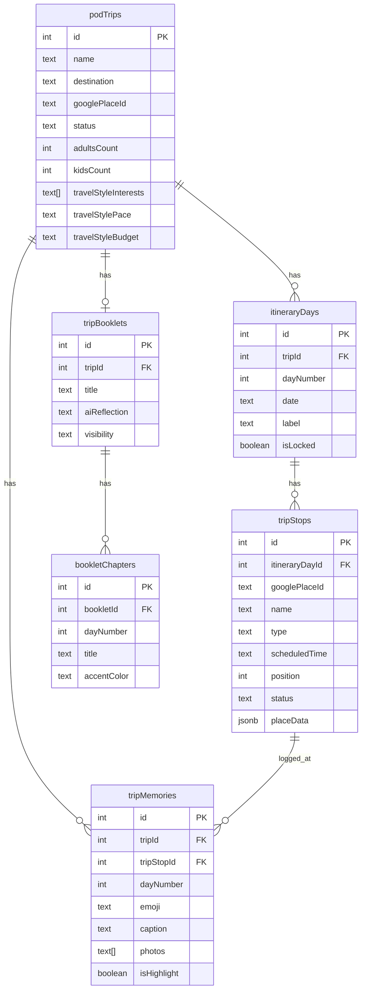

# feat: Rebuild Trip Planner (Pre-Trip, Trip Mode, Post-Trip Booklet)

**Priority:** High -- Core product loop
**Estimated effort:** 4 sprints (2 weeks each)
**Type:** Major feature overhaul
**PRD:** `/Users/seanwilkinson/Downloads/famvoy-trip-prd.docx`

---

## Overview

Rebuild the FamVoy trip planner from the PRD to create a complete trip lifecycle: a 5-step pre-trip wizard, a dark-themed mobile-first Trip Mode for live tracking and memory logging, and a magazine-style post-trip booklet with AI reflection and publish flow.

The existing codebase has a solid foundation (~60% reusable: schema, auth, API patterns, Google Places, OpenAI integration) but the UX needs a ground-up redesign. The current flow is a single modal + monolithic TripDetails page. The PRD calls for a proper wizard, a dedicated Trip Mode experience, and a booklet artifact that doesn't exist yet.

## Problem Statement

The current trip planner suffers from three core issues:

1. **Monolithic UX**: Everything lives in one 2000+ line `TripDetails.tsx`. Trip creation is a bare modal. There's no wizard, no progressive disclosure, no clear "you're done" moment.

2. **No Trip Mode**: The on-trip experience is just a basic TodayCard bolted onto TripDetails. There's no live tracking, no memory logging, no dark theme for outdoor use, no map view.

3. **No Post-Trip Artifact**: TripBook.tsx is a basic photo-by-day grid. There's no booklet structure, no AI reflection, no chapters, no publish-to-profile flow.

## Proposed Solution

### Data Model Changes

The biggest structural change: **ItineraryDay becomes a first-class entity** (currently days are just a `dayNumber` on tripItems). This enables per-day locking, labels, and the booklet chapter mapping.

#### New Table: `itineraryDays`
```
itineraryDays
  id: serial PK
  tripId: integer FK -> podTrips.id
  dayNumber: integer NOT NULL
  date: text NOT NULL (ISO date)
  label: text (nullable, auto-generated or user-edited)
  isLocked: boolean DEFAULT false
  createdAt: timestamp

  INDEX(tripId)
  UNIQUE(tripId, dayNumber)
```

#### New Table: `tripStops` (replaces current `tripItems` for new trips)
```
tripStops
  id: serial PK
  itineraryDayId: integer FK -> itineraryDays.id
  googlePlaceId: text (nullable -- AI suggestions may not resolve)
  name: text NOT NULL
  type: text NOT NULL ("stay" | "activity" | "food" | "transport")
  scheduledTime: text (nullable, e.g. "2:00 PM")
  notes: text (nullable)
  position: integer NOT NULL (sort order within day)
  status: text DEFAULT "upcoming" ("upcoming" | "current" | "done")
  suggestedBy: integer FK -> users.id (nullable, for pod suggestions)
  checkInAt: timestamp (nullable)
  coordinates: jsonb (nullable, {lat, lng} from Google Places)
  placeData: jsonb (nullable, cached Google Places response: name, address, rating, hours, photos)
  createdAt: timestamp

  INDEX(itineraryDayId)
```

#### New Table: `tripMemories`
```
tripMemories
  id: serial PK
  tripId: integer FK -> podTrips.id
  tripStopId: integer FK -> tripStops.id (nullable -- can log without a stop)
  dayNumber: integer NOT NULL
  userId: integer FK -> users.id
  emoji: text (nullable)
  caption: text (nullable, max 500 chars)
  photos: text[] (nullable, array of storage URLs)
  tag: text (nullable, "milestone" | "food" | "scenery" | "culture" | "family" | "history")
  isHighlight: boolean DEFAULT false
  loggedAt: timestamp DEFAULT now()
  createdAt: timestamp

  INDEX(tripId)
  INDEX(tripStopId)
```

#### New Table: `tripBooklets`
```
tripBooklets
  id: serial PK
  tripId: integer FK -> podTrips.id (1:1)
  title: text NOT NULL (defaults to trip.name)
  subtitle: text (nullable)
  coverEmoji: text (nullable)
  aiReflection: text (nullable)
  visibility: text DEFAULT "private" ("public" | "friends" | "private")
  publishedAt: timestamp (nullable)
  stats: jsonb (nullable, {totalStops, totalMemories, totalPhotos, totalMiles})
  createdAt: timestamp

  UNIQUE(tripId)
```

#### New Table: `bookletChapters`
```
bookletChapters
  id: serial PK
  bookletId: integer FK -> tripBooklets.id
  dayNumber: integer NOT NULL
  title: text NOT NULL
  location: text NOT NULL
  date: text NOT NULL (ISO date)
  accentColor: text NOT NULL (hex color)
  quote: text (nullable)
  sortOrder: integer NOT NULL

  INDEX(bookletId)
```

#### Modify: `podTrips`
```diff
- status: "draft" | "confirming" | "confirmed" | "booking_in_progress" | "booked"
+ status: "planning" | "active" | "completed" | "booklet_draft" | "published"

+ adultsCount: integer (nullable)
+ kidsCount: integer (nullable)
+ travelStyleInterests: text[] (nullable)
+ travelStylePace: text (nullable, "relaxed" | "balanced" | "packed")
+ travelStyleBudget: text (nullable, "budget" | "midrange" | "splurge")
+ googlePlaceId: text (nullable, for primary destination)
```

#### ERD



### What We Keep vs. What We Replace

**KEEP (reuse as-is):**
- `shared/schema.ts` structure and Drizzle patterns
- `server/lib/tripAuth.ts` (assertTripAccess)
- Clerk auth middleware (requireAuth, getAuth)
- Google Places API proxy (`/api/places/*` routes)
- OpenAI integration pattern (upgrade to streaming)
- Supabase Storage for photos
- TanStack Query patterns in client
- shadcn/ui component library
- Bottom nav, sidebar, layout components
- `dreamBoardItems`, `tripFollowers`, `tripReactions`, `tripComments` tables

**KEEP BUT MODIFY:**
- `podTrips` table (add new columns, change status enum)
- `server/routes.ts` (add new endpoints, keep existing non-trip routes)
- `server/storage.ts` (add new storage methods)
- `client/src/lib/api.ts` (add new API methods)
- `client/src/App.tsx` (add new routes)

**REPLACE (new implementations):**
- Trip creation flow (new 5-step wizard pages)
- Trip detail/editing (new itinerary editor)
- Trip Mode (entirely new dark-themed experience)
- Post-trip booklet (entirely new)
- `tripItems` usage for new trips (replaced by `itineraryDays` + `tripStops`)

**DEPRECATE (keep for existing trips, don't use for new ones):**
- `tripItems` table (existing trips reference it; new trips use `tripStops`)
- `tripDestinations` table (PRD uses single destination + `additional_stops` on trip)
- `tripConfirmationSessions`, `tripItemOptions` (confirmation wizard is out of scope in new PRD)
- `tripItemBookingMeta`, `bookingOptions` (booking flow deferred)
- `TripConfirmWizard.tsx`, `TripBook.tsx` (replaced by new pages)

---

## Technical Approach

### Architecture

#### Routing Structure (matches PRD section 5.1)

```
/trips/new                    → PreTripWizard (Step 1: Setup)
/trips/new/style              → PreTripWizard (Step 2: Travel Style)
/trips/new/generate           → PreTripWizard (Step 3: AI Generation)
/trips/:id/plan               → ItineraryEditor (Step 4: Build & Refine)
/trips/:id/finalize           → LockAndShare (Step 5: Lock & Share)
/trips/:id/live               → TripMode (Today tab, default)
/trips/:id/live/map           → TripMode (Map tab)
/trips/:id/live/memories      → TripMode (Memories tab)
/trips/:id/live/pod           → TripMode (Pod tab)
/trips/:id/booklet            → Booklet (Cover)
/trips/:id/booklet/chapters   → Booklet (Chapters)
/trips/:id/booklet/map        → Booklet (Map)
/trips/:id/booklet/publish    → Booklet (Publish)
```

#### API Endpoints (matches PRD section 5.2)

```
POST   /api/trips                                    → Create trip
PATCH  /api/trips/:id                                → Update trip fields
POST   /api/trips/:id/generate-itinerary             → AI generation (streaming SSE)
GET    /api/trips/:id/days                            → List itinerary days
PATCH  /api/trips/:id/days/:dayId                     → Update day (lock, label)
POST   /api/trips/:id/days/:dayId/stops               → Add stop to day
PATCH  /api/trips/:id/days/:dayId/stops/:stopId       → Update stop
DELETE /api/trips/:id/days/:dayId/stops/:stopId        → Remove stop
POST   /api/trips/:id/days/:dayId/stops/reorder       → Reorder stops
POST   /api/trips/:id/memories                        → Create memory
PATCH  /api/trips/:id/memories/:memoryId               → Update memory
POST   /api/trips/:id/activate                        → Transition to active
POST   /api/trips/:id/complete                        → Transition to completed
GET    /api/trips/:id/booklet                         → Fetch booklet data
POST   /api/trips/:id/booklet/generate-reflection     → AI reflection (streaming SSE)
PATCH  /api/trips/:id/booklet                         → Update booklet
POST   /api/trips/:id/booklet/publish                 → Publish booklet
```

#### Streaming AI Generation

Use Server-Sent Events (SSE) for itinerary generation and AI reflection:

```typescript
// server: streaming endpoint pattern
app.post("/api/trips/:id/generate-itinerary", requireAuth(), async (req, res) => {
  res.setHeader("Content-Type", "text/event-stream");
  res.setHeader("Cache-Control", "no-cache");
  res.setHeader("Connection", "keep-alive");

  // Send progress events
  res.write(`data: ${JSON.stringify({ step: "analyzing_style", progress: 20 })}\n\n`);

  // Stream OpenAI response
  const stream = await openai.chat.completions.create({ stream: true, ... });
  for await (const chunk of stream) {
    res.write(`data: ${JSON.stringify({ step: "generating", chunk: chunk.choices[0]?.delta?.content })}\n\n`);
  }

  res.write(`data: ${JSON.stringify({ step: "complete", itinerary: parsed })}\n\n`);
  res.end();
});
```

#### Google Places Server-Side Resolution

After AI generates stop names, resolve each to a real Google Place:

```typescript
async function resolveStopToPlace(stopName: string, destination: string) {
  const response = await fetch(
    `https://places.googleapis.com/v1/places:searchText`,
    {
      method: "POST",
      headers: { "X-Goog-Api-Key": process.env.GOOGLE_PLACES_API_KEY },
      body: JSON.stringify({ textQuery: `${stopName} in ${destination}` })
    }
  );
  // Return: place_id, name, address, rating, photos, coordinates
}
```

### Implementation Phases

#### Phase 1: Schema & Pre-Trip Wizard (Sprint 1)

**Goal:** New data model + 5-step wizard producing a generated itinerary.

**Schema work:**
- [ ] Add `itineraryDays` table to `shared/schema.ts`
- [ ] Add `tripStops` table to `shared/schema.ts`
- [ ] Add `tripMemories` table to `shared/schema.ts`
- [ ] Add `tripBooklets` table to `shared/schema.ts`
- [ ] Add `bookletChapters` table to `shared/schema.ts`
- [ ] Add new columns to `podTrips` (adultsCount, kidsCount, travelStyle*, googlePlaceId)
- [ ] Update podTrips status enum to: planning | active | completed | booklet_draft | published
- [ ] Add storage methods for all new tables (CRUD)
- [ ] Run `db:push` to apply schema

**Pre-Trip Wizard pages:**
- [ ] `client/src/pages/trip-wizard/TripSetup.tsx` (Step 1) -- name, destination (Google Places autocomplete), dates, adults/kids count, optional pod
- [ ] `client/src/pages/trip-wizard/TravelStyle.tsx` (Step 2) -- interest multi-select, pace selector, budget vibe
- [ ] `client/src/pages/trip-wizard/AIGeneration.tsx` (Step 3) -- streaming loading animation, progress steps
- [ ] `client/src/pages/trip-wizard/ItineraryEditor.tsx` (Step 4) -- day tabs, stop cards, drag reorder, add/swap/remove stops, inline AI suggestions, lock days
- [ ] `client/src/pages/trip-wizard/LockAndShare.tsx` (Step 5) -- summary card, per-day lock status, pod sharing, export options, "Start Trip" CTA

**API endpoints:**
- [ ] `POST /api/trips` -- create trip with new fields (adultsCount, kidsCount, travelStyle)
- [ ] `POST /api/trips/:id/generate-itinerary` -- streaming SSE endpoint, AI generation with Google Places resolution
- [ ] `GET /api/trips/:id/days` -- list itinerary days with stops
- [ ] `PATCH /api/trips/:id/days/:dayId` -- update day (lock, label)
- [ ] `POST /api/trips/:id/days/:dayId/stops` -- add stop (Google Places search)
- [ ] `PATCH /api/trips/:id/days/:dayId/stops/:stopId` -- update stop
- [ ] `DELETE /api/trips/:id/days/:dayId/stops/:stopId` -- remove stop (soft delete with undo)
- [ ] `POST /api/trips/:id/days/:dayId/stops/reorder` -- reorder stops within day

**Wizard state management:**
- [ ] Store wizard progress in trip record (step reached, data collected per step)
- [ ] Use URL-based step navigation (each step is a route)
- [ ] Persist form data to server on each step completion (not just local state)

**Files to create:**
- `client/src/pages/trip-wizard/TripSetup.tsx`
- `client/src/pages/trip-wizard/TravelStyle.tsx`
- `client/src/pages/trip-wizard/AIGeneration.tsx`
- `client/src/pages/trip-wizard/ItineraryEditor.tsx`
- `client/src/pages/trip-wizard/LockAndShare.tsx`
- `client/src/components/trip-wizard/StepProgressBar.tsx`
- `client/src/components/trip-wizard/InterestPicker.tsx`
- `client/src/components/trip-wizard/PaceSelector.tsx`
- `client/src/components/trip-wizard/BudgetPicker.tsx`
- `client/src/components/trip-wizard/DayTabStrip.tsx`
- `client/src/components/trip-wizard/StopCard.tsx`
- `client/src/components/trip-wizard/AddStopSheet.tsx`
- `client/src/components/trip-wizard/AIGenerationAnimation.tsx`

**Files to modify:**
- `shared/schema.ts` -- new tables and columns
- `server/storage.ts` -- new storage methods
- `server/routes.ts` -- new API endpoints
- `client/src/lib/api.ts` -- new API client methods
- `client/src/App.tsx` -- new routes

#### Phase 2: Trip Mode (Sprint 2)

**Goal:** Dark-themed mobile-first live trip experience with memory logging.

**Trip Mode pages:**
- [ ] `client/src/pages/trip-mode/TripModeLayout.tsx` -- dark theme wrapper, tab navigation (Today / Map / Memories / Pod), live indicator with green pulse
- [ ] `client/src/pages/trip-mode/TodayTab.tsx` -- current stop hero card with check-in + "Log Memory", up next strip, full day timeline, day progress bar
- [ ] `client/src/pages/trip-mode/MapTab.tsx` -- full-screen map with stop pins (done/current/upcoming), current location pulse, "Open in Maps" button
- [ ] `client/src/pages/trip-mode/MemoriesTab.tsx` -- chronological feed of TripMemory records, highlight toggle, "Add Memory" button
- [ ] `client/src/pages/trip-mode/PodTab.tsx` -- co-traveling families, shared moments feed, "Plan a Meet-Up" CTA

**Memory logging:**
- [ ] `client/src/components/trip-mode/MemoryLogSheet.tsx` -- bottom sheet: stop context, emoji mood picker (10 emojis horizontal scroll), caption field (500 char), photo attachment, save button
- [ ] `POST /api/trips/:id/memories` -- create memory with photo upload to Supabase Storage
- [ ] `PATCH /api/trips/:id/memories/:memoryId` -- update memory (caption, highlight, tag)
- [ ] `GET /api/trips/:id/memories` -- list memories for trip

**Status transitions:**
- [ ] `POST /api/trips/:id/activate` -- set status to "active", set activatedAt
- [ ] `POST /api/trips/:id/complete` -- set status to "completed", set completedAt, trigger booklet auto-assembly
- [ ] Auto-activation: cron job or on-access check when `today >= startDate`

**Stop check-in flow:**
- [ ] Check-in button on stop card sets `tripStops.status = "current"`, records `checkInAt`
- [ ] Mark done sets `status = "done"`
- [ ] Up Next strip shows the first `status = "upcoming"` stop

**Map integration:**
- [ ] Use Google Maps JavaScript SDK (already have API key)
- [ ] Custom pin styles: green pulse for current location, muted for done, outlined for upcoming
- [ ] Deep link to native Maps app for directions

**Dark theme CSS:**
- [ ] Dark backgrounds (#0D1117), green pulse (#4ADE80) for live indicators
- [ ] High contrast text for sunlight readability
- [ ] Touch targets >= 44px for outdoor use
- [ ] Scoped to `/trips/:id/live/*` routes only (not app-wide dark mode)

**Files to create:**
- `client/src/pages/trip-mode/TripModeLayout.tsx`
- `client/src/pages/trip-mode/TodayTab.tsx`
- `client/src/pages/trip-mode/MapTab.tsx`
- `client/src/pages/trip-mode/MemoriesTab.tsx`
- `client/src/pages/trip-mode/PodTab.tsx`
- `client/src/components/trip-mode/MemoryLogSheet.tsx`
- `client/src/components/trip-mode/StopHeroCard.tsx`
- `client/src/components/trip-mode/DayTimeline.tsx`
- `client/src/components/trip-mode/DayProgressBar.tsx`
- `client/src/components/trip-mode/EmojiMoodPicker.tsx`
- `client/src/components/trip-mode/LiveIndicator.tsx`
- `client/src/components/trip-mode/UpNextStrip.tsx`
- `client/src/components/trip-mode/TripModeMap.tsx`

#### Phase 3: Post-Trip Booklet (Sprint 3)

**Goal:** Auto-assembled magazine-style booklet with AI reflection and publish flow.

**Booklet auto-assembly (server-side):**
- [x] On trip completion, create `tripBooklets` record
- [x] Create one `bookletChapters` record per itinerary day
- [x] Auto-assign chapter titles from day labels
- [x] Auto-assign accent colors from a palette (one per day)
- [x] Link memories to chapters by `dayNumber`
- [x] Promote `isHighlight = true` memories to hero position
- [x] Auto-populate chapter quote from highest-engagement caption
- [x] Compute stats: totalStops, totalMemories, totalPhotos

**Booklet pages:**
- [x] `client/src/pages/booklet/BookletCover.tsx` -- hero gradient, trip name in serif, stats row, AI reflection section with "Generate with AI" CTA, chapter list
- [x] `client/src/pages/booklet/BookletChapters.tsx` -- day tab strip, chapter header with accent color, hero memory card, 2-column memory grid, pull quote, prev/next navigation
- [x] `client/src/pages/booklet/BookletMap.tsx` -- static map with teardrop pins color-coded by chapter, public/private toggle
- [x] `client/src/pages/booklet/BookletPublish.tsx` -- visibility selector, share options (copy link, email, send to pod), publish button, success state

**AI Reflection:**
- [x] `POST /api/trips/:id/booklet/generate-reflection` -- streaming SSE endpoint
- [x] Prompt: warm, personal 2-3 paragraphs referencing specific memories, destination, duration, travel style
- [x] Typewriter animation on client (character by character from SSE stream)
- [x] Store in `tripBooklets.aiReflection`
- [x] User can regenerate or manually edit inline

**Booklet design:**
- [x] Warm cream (#FAF7F2) background
- [x] Serif headings (Fraunces, already in design system)
- [x] Chapter accent colors: auto-assigned from palette (forest green, warm coral, sky blue, amber, lavender, etc.)
- [x] Hero memory card: full-width photo, large caption
- [x] Regular memories: 2-column grid with thumbnails

**Files to create:**
- `client/src/pages/booklet/BookletCover.tsx`
- `client/src/pages/booklet/BookletChapters.tsx`
- `client/src/pages/booklet/BookletMap.tsx`
- `client/src/pages/booklet/BookletPublish.tsx`
- `client/src/components/booklet/ChapterHeader.tsx`
- `client/src/components/booklet/HeroMemoryCard.tsx`
- `client/src/components/booklet/MemoryGrid.tsx`
- `client/src/components/booklet/StatsRow.tsx`
- `client/src/components/booklet/AIReflectionBlock.tsx`

#### Phase 4: Integration & Polish (Sprint 4)

**Goal:** Wire everything together, update navigation, handle edge cases, clean up deprecated code.

**Navigation updates:**
- [ ] Update Trips page to show new trip creation wizard entry point
- [ ] Trip list cards should route to appropriate phase (/plan, /live, /booklet) based on status
- [ ] Bottom nav: "Live Trip" tab highlights during active trip
- [ ] Trip Mode shows persistent "Trip Mode - Live" indicator

**Trip list updates:**
- [ ] Trip cards show new status badges (Planning, Active, Completed, Published)
- [ ] Active trips show green pulse dot
- [ ] Published trips show booklet preview card

**Edge cases:**
- [ ] Multi-city trips: additional_stops field on podTrips, each gets its own itinerary days
- [ ] Pod suggestions: stops with `suggestedBy` shown differently, accept/reject flow for owner
- [ ] Day regeneration: re-call AI for single day, preserve locked days
- [ ] Undo on stop deletion: 5-second toast with restore action
- [ ] Keyboard handling: memory log sheet adjusts when keyboard opens

**Cleanup:**
- [ ] Update existing trip list to work with both old and new trip formats
- [ ] Ensure old trips (using tripItems) still render in TripDetails.tsx
- [ ] Remove or archive deprecated wizard components (TripConfirmWizard.tsx)
- [ ] Split `server/routes.ts` trip section into `server/routes/trips.ts`

---

## Acceptance Criteria

### Phase 1: Pre-Trip Wizard
- [ ] User can create a trip through 5 distinct steps with back/forward navigation
- [ ] Step 1 collects: name, destination (Google Places), dates, adults, kids, optional pod
- [ ] Step 2 collects: interests (multi-select), pace, budget
- [ ] Step 3 shows animated AI generation with streaming progress events
- [ ] Step 4 renders day-by-day itinerary with stop cards, drag reorder, add/swap/remove
- [ ] Step 4 allows locking individual days
- [ ] Step 5 shows trip summary with lock status, sharing controls, "Start Trip" CTA
- [ ] AI generation resolves stop names to Google Places IDs server-side
- [ ] Unresolvable stops flagged as "unverified"
- [ ] `itineraryDays` and `tripStops` tables populated correctly

### Phase 2: Trip Mode
- [ ] Trip Mode activates when status = "active" (manual or auto on start date)
- [ ] Dark-themed UI with green pulse live indicator
- [ ] Today tab shows current stop hero, up next strip, full day timeline
- [ ] Check-in sets stop status to "current" then "done"
- [ ] Day progress bar updates live as stops are checked in
- [ ] Memory log bottom sheet: emoji picker, caption, photo upload, save
- [ ] Memories tab shows chronological feed with highlight toggle
- [ ] Map tab shows stop pins with current location
- [ ] All touch targets >= 44px

### Phase 3: Booklet
- [x] Booklet auto-assembles on trip completion
- [x] One chapter per day with auto-assigned accent color
- [x] Highlight memories promoted to hero position
- [x] AI reflection generates via streaming with typewriter animation
- [x] User can edit chapter titles, quotes, and reflection inline
- [x] Visibility selector (public/friends/private)
- [x] Publish sets publishedAt and transitions status to "published"

### Phase 4: Integration
- [ ] Trip list shows new status system with appropriate routing
- [ ] Old trips still accessible via existing TripDetails page
- [ ] Navigation handles all trip lifecycle states correctly

---

## Dependencies & Risks

**Dependencies:**
- Google Places API (Text Search API for stop resolution) -- already integrated
- OpenAI API (GPT-4o-mini) -- already integrated, needs streaming upgrade
- Supabase Storage -- already integrated for photo uploads
- Google Maps JavaScript SDK -- needs client-side integration for map views
- `@dnd-kit/core` -- already installed for drag reorder

**Risks:**
- **Data migration**: Old trips use `tripItems`, new trips use `tripStops`. Both must coexist. Mitigate by keeping old tables and routing old trips to old UI.
- **Google Places rate limits**: AI generates 15-25 stops per trip, each needs resolution. Mitigate by batching and caching.
- **Streaming SSE**: Not currently used in the app. Need to verify works through Vercel serverless. Mitigate by having non-streaming fallback.
- **Map SDK bundle size**: Google Maps JS SDK is large. Mitigate by lazy loading only on map routes.

---

## Out of Scope (per PRD Section 5.4)

- Full Pod architecture and invitation/management flows
- Discovery map and social feed (separate PRD)
- Family profile setup and onboarding
- Push notification system
- PDF export implementation
- Instagram Story card generation
- Offline mode / local caching for Trip Mode
- Booking/confirmation wizard (existing flow preserved for old trips but not rebuilt)

---

## References

### Internal
- `shared/schema.ts` -- existing trip tables (podTrips:246, tripItems:287, tripDestinations:275)
- `server/routes.ts` -- existing trip endpoints (lines 1856-3650)
- `server/storage.ts` -- existing trip storage methods (lines 1334-1632)
- `server/lib/tripAuth.ts` -- authorization helper
- `client/src/pages/TripDetails.tsx` -- current monolithic trip page (2000+ lines)
- `client/src/pages/TripBook.tsx` -- current basic trip book
- `client/src/pages/Trips.tsx` -- trip list page
- `client/src/components/trip/TodayCard.tsx` -- existing today card component
- `client/src/lib/api.ts:736-902` -- existing trip API methods

### External
- [Google Places Text Search API](https://developers.google.com/maps/documentation/places/web-service/text-search)
- [Google Maps JavaScript SDK](https://developers.google.com/maps/documentation/javascript)
- [OpenAI Streaming](https://platform.openai.com/docs/api-reference/streaming)
- [dnd-kit](https://dndkit.com/) -- drag and drop
- [Framer Motion](https://www.framer.com/motion/) -- animations (already installed)

### PRD
- `/Users/seanwilkinson/Downloads/famvoy-trip-prd.docx` -- Full PRD with mockup references
